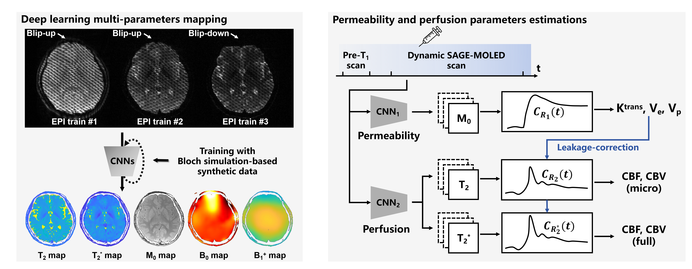

# Spin and gradient multiple overlapping-echo detachment imaging (SAGE-MOLED)

**Contact**: Qinqin Yang (qinqin.yang@uci.edu)

## Related Paper:

Spin and gradient multiple overlapping-echo detachment imaging (SAGE-MOLED): highly efficient T2, T2*, and M0 mapping for simultaneous perfusion and permeability measurements 

**Status:** _Under Review at Magnetic Resonance in Medicine (MRM)

**SAGE-MOLED parametric mapping:**

## Dependencies

**Deep Learning**: Python (version 3.9.13) and PyTorch library (version 2.1.0)

**Pre/Post-processing**: MATLAB R2024a

## Code Directory Overview

`code_DSC_DCE_process` : Code for parameter estimation in perfusion (DSC) and permeability (DCE) analysis, including SVD-based deconvolution methods, the extended Tofts model, and leakage correction techniques.

`code_DSC_DCE_simulation` : Code for DSC–DCE numerical experiments, including generation of virtual objects (VObj) based on hemodynamic models and arterial input function (AIF) synthesis.

`code_Reference_map` : Example data and fitting scripts for SE, GRE, and SAGE-EPI, used to generate reference T2 and T2* maps.

`Deep_Learning_SAGE` : Code for SAGE-MOLED parametric mapping (T2, T2*, M0, etc.) based on the R2AttUNet architecture, along with scripts for processing training and testing datasets.

**Simultaneous perfusion and permeability measurements:**

